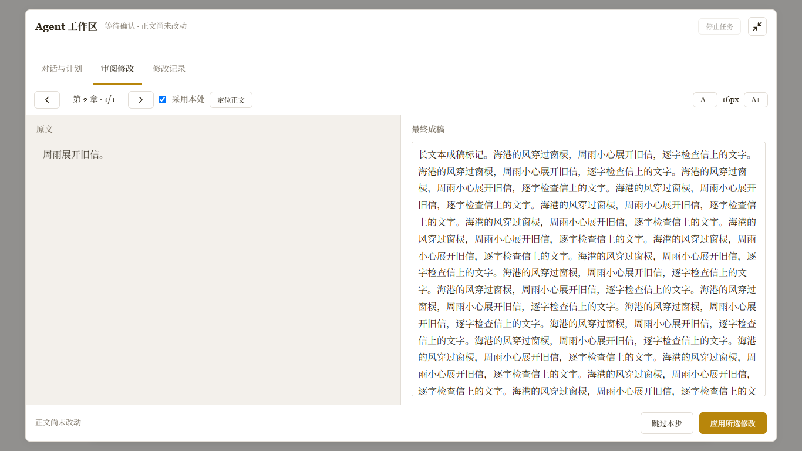

# 长篇小说写作助手 V4.5.0

**Long-form Novel Writing Assistant**

[在线使用](https://nanbo0ne.github.io/novel-writer/) · [下载独立版](./novel-writer-V4.5.0.html) · [English](#english)

## 简介

长篇小说写作助手是一款本地优先的单文件 HTML 创作工具。它把项目设定、大纲、分章正文、长期记忆、审稿修改、全文编辑 Agent 和多格式导出集中在一个浏览器页面中，适合持续创作中长篇与超长篇小说。

V4.5.0 是单模式公开版：只保留原始普通写作模式和默认视觉主题，不包含加密载荷，也没有隐藏的替代模式或主题。源码与应用都在同一个 HTML 文件里，可直接阅读、下载和离线运行。本版新增可展开的 Agent 改稿工作区、按项目隔离的会话回退记录，并修复大纲导入、空会话恢复、原样正文备份和专家建议采用状态。

## 核心能力

- **完整创作流程**：项目设定、大纲生成与续写、分章写作、续写、结尾、审稿和导出。
- **任务模型分工**：为全局思维、编辑润色、正文创作、注意事项记忆和 JSON 修复分别选择模型。
- **DeepSeek 思考控制**：支持全局与任务级思考开关，以及 `high` / `max` 思考强度。
- **DeepSeek 生成增强**：内置两套不可修改的增强模板，也可新增、复制、编辑和删除自定义模板；只对实际路由到 DeepSeek 的生成请求生效。
- **虚拟首轮注入**：大纲生成和分章写作可分别配置虚拟用户消息、模型思考与模型回复，默认关闭。
- **长篇连贯性**：章节摘要、长期记忆、章节桥接、剧情关键点和前文上下文协同工作；承接信息只在下一章生成前按需整理。
- **全书创作注意事项**：在创作规则中维护独立的长期要求，并跟随大纲、正文、续写三个既有注入开关。
- **记忆控制与进度**：写作页可关闭自动记忆写入；承接、长期记忆和章节摘要卡会在独立弹窗中实时显示，支持后台继续、重新查看和单独终止整理。
- **全文编辑 Agent**：可连续调用读取、搜索和编辑工具直到任务完成；选中的重点片段会持续高亮并显示在侧栏，但不会限制 Agent 按指令处理其他位置。
- **可审阅改稿**：完整诊断显示在对话中，计划按修改位置归并；应用前可直接编辑最终成稿，再逐项确认、跳过、定位和撤销。
- **增强工具兼容**：支持标准 `tool_calls`、旧式 `function_call` 及常见 JSON 工具格式，原始工具代码不会显示在对话中。
- **审稿与修改**：一致性检查、专家意见、去 AI 味、修改前后对比和章节历史快照。
- **本地数据**：项目数据保存在浏览器 IndexedDB，可导入导出 JSON 备份。
- **单文件运行**：无需安装、构建或后端服务，下载 HTML 后即可打开。

## 快速开始

1. 打开[在线版本](https://nanbo0ne.github.io/novel-writer/)，或下载 `novel-writer-V4.5.0.html` 后用浏览器打开。
2. 在“设置”中填写 OpenAI 兼容 API 地址、API Key 和模型名称。
3. 填写书名、类型、世界观、人物设定、章节数和每章目标字数。
4. 生成或导入大纲，然后进入“写作”逐章创作。
5. 使用“编辑”中的 Agent 做选区润色、计划修改和可撤销的全文修订。
6. 定期从“导出”下载项目 JSON 备份和正文文件。
7. 如需彻底清空当前网页来源的数据，可在“设置”底部使用需要二次确认的“恢复默认设置”。

## 模型与接口

应用使用 OpenAI 兼容的 Chat Completions 接口。不同任务可以使用不同 API 配置与模型；未单独指定时会回退到当前基础模型。DeepSeek 模型可额外配置思考模式与思考强度。

API 服务商对模型名称、参数、上下文长度和数据保留政策的支持可能不同，请以服务商文档为准。

## 数据与隐私

- 项目、章节、对话、记忆和设置默认保存在当前浏览器的 IndexedDB 中。
- Agent 临时修改记录单独保存在当前标签页的 sessionStorage：刷新保留，正常关闭后清空；不随项目 JSON 导出，浏览器恢复标签页时可能恢复这些记录。旧永久 Agent 历史不混入，也不主动删除。
- API Key 保存在浏览器本地，不会被上传到本仓库。
- 只有执行 AI 功能时，对应上下文才会发送到你配置的 API 服务商。
- 更换浏览器、清理网站数据或使用无痕模式可能导致本地项目不可用，请定期导出 JSON 备份。
- V4.5.0 会忽略旧版不兼容的模式数据，不显示或执行它们，也不会主动删除原有本地记录。

## 文件

| 文件 | 用途 |
| --- | --- |
| `index.html` | GitHub Pages 入口 |
| `novel-writer-V4.5.0.html` | 可下载、可离线打开的独立版本 |
| `docs/screenshot.png` | README 界面预览 |

## 作者

伯劳

---

# English

## Overview

Long-form Novel Writing Assistant is a local-first, single-file HTML workspace for planning, drafting, revising, and exporting long-form fiction. Project settings, outlines, chapter drafts, continuity memory, review tools, a full-manuscript editing agent, and exports all live in one browser application.

V4.5.0 is the public single-mode edition. It contains only the original writing mode and the default visual theme, without encrypted payloads or hidden alternative modes. This release adds an expandable Agent revision workspace and project-isolated session undo, and fixes outline import validation, empty chat recovery, exact manuscript backups and expert suggestion adoption status.

## Highlights

- **End-to-end writing workflow** for projects, outlines, chapters, continuation, endings, reviews, and exports.
- **Task-specific model routing** for global reasoning, editing, chapter writing, memory, and JSON repair.
- **DeepSeek thinking controls** with global and per-task settings plus `high` / `max` effort.
- **DeepSeek generation boost** with two immutable built-in templates plus user-managed custom templates, applied only to requests actually routed to DeepSeek.
- **Virtual first-turn injection** for outline and chapter generation, with separate virtual user, reasoning, and assistant fields that are disabled by default.
- **Long-form continuity tools** including summaries, persistent memory, chapter bridges generated only when the next chapter begins, and plot points.
- **Whole-book creative notes** stored separately in Creative Rules and governed by the existing outline, chapter, and continuation injection switches.
- **Memory controls and live context progress** with a global automatic-write toggle, separate bridge/memory panels, background continuation, reopen, and context-only cancellation.
- **Full-manuscript editing agent** that keeps reading, searching, and editing until the task is complete; pinned excerpts remain highlighted in the manuscript and visible in the sidebar without restricting edits elsewhere when the instruction requires them.
- **Reviewable revisions** with full diagnostics in chat, location-based plan cards, editable final replacement text, step skipping, confirmation, history, and undo.
- **Broader tool-call compatibility** for standard `tool_calls`, legacy `function_call`, and common JSON tool envelopes without exposing raw tool code in the conversation.
- **Revision safety** through consistency checks, expert feedback, before/after comparison, and chapter snapshots.
- **Local-first storage** in IndexedDB with JSON project backup and restore.
- **No installation or build step**: download the HTML file and open it in a modern browser.

## Quick Start

1. Open the [live application](https://nanbo0ne.github.io/novel-writer/) or download `novel-writer-V4.5.0.html`.
2. Open Settings and enter an OpenAI-compatible Base URL, API key, and model name.
3. Define the title, genre, world, cast, chapter count, and target chapter length.
4. Generate or import an outline, then draft chapters in the Writing view.
5. Use the Editing Agent for focused rewrites, reviewable plans, and reversible manuscript changes.
6. Export project backups regularly from the Export view.

## Models and APIs

The application uses an OpenAI-compatible Chat Completions endpoint. Each task category can use its own API configuration and model, with the current base model as fallback. DeepSeek models can also use configurable thinking mode and reasoning effort.

Model names, supported parameters, context limits, and data-retention policies depend on your API provider.

## Data and Privacy

- Projects, chapters, chats, memory, and settings are stored locally in browser IndexedDB.
- API keys remain in local browser storage and are not committed to this repository.
- Disabling automatic memory stops automatic memory and summary-card writes while keeping existing memory available as writing context; manual memory updates remain available.
- Factory reset removes only this application data for the current page origin and requires two confirmations.
- Context is sent only when you invoke an AI-powered action, and only to the API endpoint you configured.
- Clearing site data, switching browsers, or using private browsing can make local projects unavailable. Export JSON backups regularly.
- V4.5.0 ignores incompatible legacy mode data without displaying, executing, or actively deleting the original local records.

## Author

伯劳 (Bolao)

## V4.5.0 · 改稿工作区与会话回退 / Revision Workspace and Session Undo

热修复：Agent 展开按钮在大窗口中切换为“收起”，再次点击返回侧栏，保留草稿和待确认修改。Hotfix: the Agent expand button now becomes Collapse in the workspace and returns to the sidebar without losing drafts or pending edits.

- **展开 Agent 工作区**：保留紧凑侧栏，也可在页面内打开“对话与计划 / 审阅修改 / 修改记录”。原文与成稿宽屏并排，窄屏切换；成稿可连续多段编辑，独立字号调节，操作按钮始终可达。
- **临时修改记录**：每个实际应用的 Agent 补丁先备份、再保存正文，支持撤销本处、撤销本步，以及预览范围后回退到某步之前。批量回退先完整校验，冲突时全部取消，不覆盖后来的手工修改。
- **会话生命周期**：记录按项目隔离保存在当前标签页的 sessionStorage，刷新保留，正常关闭标签页后清空；浏览器恢复标签页可能恢复会话。记录不包含在项目 JSON 或新的永久 Agent 快照中，存储不足时停止写入，不静默截断旧记录。其他功能的历史快照保持不变。
- **数据与流程修复**：大纲导入拒绝重复、缺号和非法章号；空对话项目自动恢复可用会话；JSON 备份保留正文原始空行和空格；专家建议只在真正采用后标记“已应用”。直接修改模式继续保留，不增加强制范围审批。

The expandable in-page Agent workspace shares the same conversation, plan and draft with the sidebar. Review original and final text side by side, or switch views on narrow screens. Large editable text areas, independent type sizing and fixed actions make long revisions easier to review.

Every applied Agent patch is backed up before the manuscript is committed. Undo a patch or step, or preview and rewind multiple steps atomically. A manual-edit conflict cancels the entire rollback. Records live in per-project **sessionStorage**: refresh preserves them; closing the tab normally clears them, while browser session restoration may restore them. They are not exported in project JSON or stored as new permanent Agent snapshots. Full storage blocks the edit instead of silently discarding older records. Existing snapshots from other workflows are unchanged.

This release also validates imported outline numbering, restores an empty chat session, preserves exact manuscript whitespace in JSON backups, and only marks expert suggestions as applied after adoption. Direct editing remains available without mandatory scope approval.

## V4.4.9 · 自由篇幅与参考前文 / Flexible Length and Prior Story

章节数量和每章字数可分别留空，由 AI 根据故事自然决定；实际章节和一键生成遵循大纲，不为凑字数自动补写。项目页新增带独立开关的“参考前文”，默认关闭；开启后将完整前文提供给大纲和正文创作，关闭仍保留文本。支持保存、项目备份与导入；不自动摘要或截断，超出模型上下文时会提示调整。已有正文与注意事项保持不变。

Leave chapter count or target words blank to let the model choose the scope naturally. Generation and progress follow the actual outline, without automatic word-count padding. **Prior Story** adds a per-project toggle, off by default: when enabled, the full text is included in outline and manuscript requests; disabling it keeps the saved text. Project backups retain both text and settings. No automatic summarization or truncation; context-limit errors prompt you to shorten the reference or change models. Existing chapters and notes are preserved.

## V4.4.8 · AI 大纲修订 / Outline Revision

在大纲页点击“AI 修改大纲”，发送完整大纲和修改意见，逐章对比新版后统一采用或取消。可请求增减章节、调整每章目标字数；采用时同步项目设置。已有正文和注意事项按原编号保留，移出大纲的正文仍可从全文编辑及导出访问。

Use **AI 修改大纲** on the outline page to revise the entire outline with one instruction. Review old/new chapters and setting changes before accepting. Chapter count and target words per chapter update together; existing manuscript text and notes remain attached to their original chapter numbers. Removed outline chapters retain their text in the full editor and exports.
